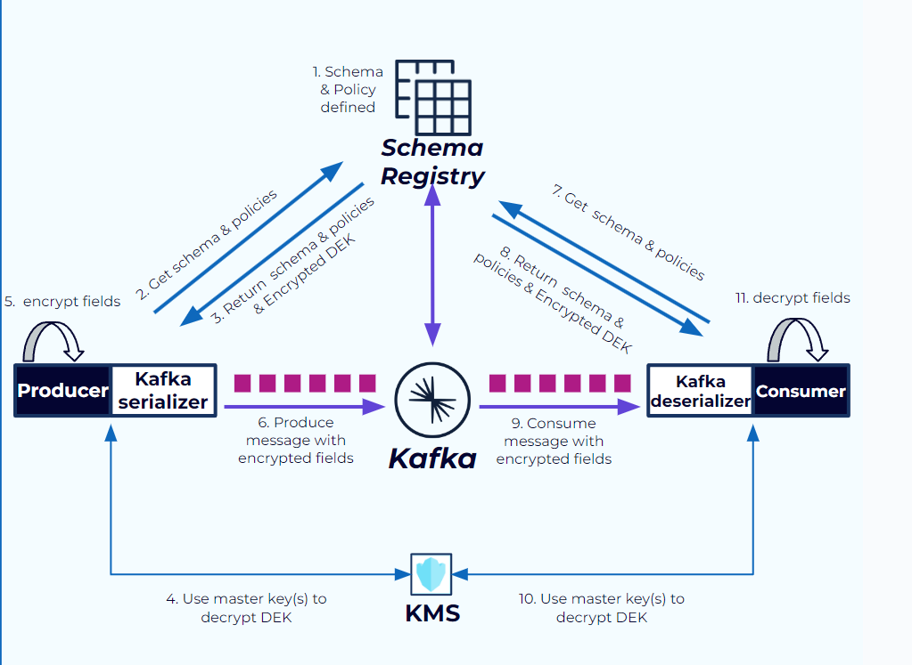
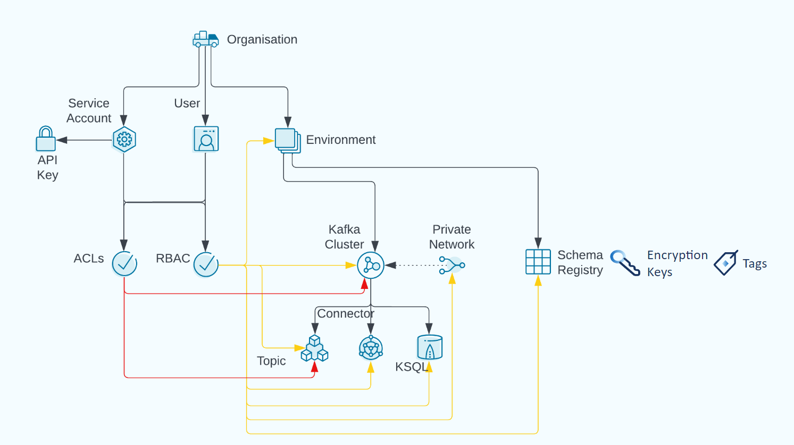
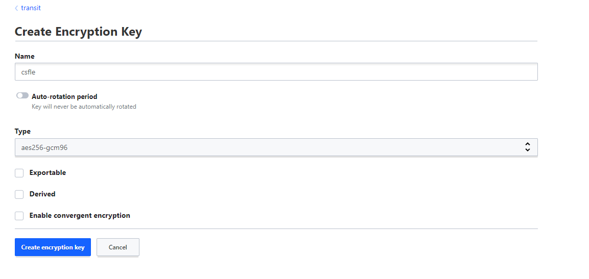

# Client-Side Field Level Encryption (CSFLE)

This repository provides a quick way to provision and experiment with [Client-Side Field Level Encryption](https://docs.confluent.io/cloud/current/clusters/csfle/overview.html)(CSFLE) feature .

This example implements the CSFLE not shared Master Key flow. In this scenario the Schema Registry has not access to the KMS. 
Clients need KMS credentials to access the Master key and decrypt the DEKs through KMS services/API, in fact the DEK Registry will make the encrypted DEK available to authorized clients. The Master Key never leaves the KMS.

.

## Prerequisites

* docker and docker-compose CLI tools
* Confluent Cloud API-Key and API-Secret having OrgAdmin role
* terraform CLI
* Confluent Platform  7.6.1 =< version <= CP 7.8.2 https://docs.confluent.io/platform/current/installation/installing_cp/zip-tar.html as we rely on kafka-avro-console-consumer and kafka-avro-console-producer tools which are provided by the CP platform in this /bin folder

## Goal

We will produce personal data to Confluent Cloud in the following form
```
{
    "number":1,
    "shipping_address":"899 W Evelyn Ave, Mountain View, CA 94041, USA",
    "amount":15.00
}
```
* By leveraging Terraform Confluent provider, we will setup and provision all the required infrastructure, resources and configuration required to run this test
* The configured encrypted rules will encrypt the `shipping_address` field.
* We then start a consumer with the corresponding configurations to decrypt the field again.
* We will also show that consumers not having access to the KMS can still consume the records, however some fields will be encrypted

## The provisioned infrastructure

Let's review Confluent Cloud resource hierarchy .

CSFLE requires the definition of a schema subject associated to a target topic. The schema is extended with encryption rules. 

The terraform manifests will:
 * Provision an Environment
   * Create a Kafka cluster
   * Enable Stream Governance Advanced package for the Environment created (Required to use Client Side Field Level encrption)
   * Register PII tag before using it in the schemas
 * Create consumers and producers service accounts, configure proper authorization through RBAC role bindings
 * Create API-Keys to access Kafka and Schema Registry
 * Create orders topic
 * Register a schema under the proper schema subject orders-value as well as the encryption rules

## Start the KMS

We rely on Hashicorp Vault. CSFLE works with the [transit secrets engine](https://developer.hashicorp.com/vault/docs/secrets/transit)

```shell
# run from kms/ folder

docker-compose up -d
```

Log in to `http://localhost:8200/` with `root-token` and navigate to http://localhost:8200/ui/vault/secrets

Under Secret Engines create a transit engine and then a key of type aes256-gcm96 named csfle.



## How to provision Confluent CLoud for CSFLE

In order to get started create a Cloud Api-Key

```shell

# run from the provisioning/ folder

export TF_VAR_confluent_cloud_api_key=<YOUR_API_KEY>
export TF_VAR_confluent_cloud_api_secret=<YOUR_API_SECRET>
# the prefix is not mandatory, however if you want to create multiple deployments of this demo in the same organization, some resource names must be unique
export TF_VAR_resources_prefix=<PREFIX>

terraform init # if you are running the example for the first time
terraform plan
terraform apply # it will take some minute

```

## Start the producer

With the help of terraform outputs and variables interpolation we can print CLI commands ready to be executed:

```shell
# open a new shell, run from /provisioning folder
terraform output resource-ids
```
Copy and run the  "kafka-avro-console-producer ..." command line from the terraform output, when the prompt is ready paste one by one some payloads, eg.

```
{"number":1,"shipping_address":"899 W Evelyn Ave, Mountain View, CA 94041, USA","amount":15.00}
{"number":2,"shipping_address":"1 Bedford St, London WC2E 9HG, United Kingdom","amount":5.00}
{"number":3,"shipping_address":"3307 Northland Dr Suite 400, Austin, TX 78731, USA","amount":10.00}
```

## Start a consumer with access to the KMS


```shell
# open a new shell, run from /provisioning folder
terraform output resource-ids
export VAULT_ADDR='http://127.0.0.1:8200'
export VAULT_TOKEN=root-token
```

Copy and run the  "kafka-avro-console-consumer --group confluent_cli_consumer_decrypted_fields ..." command line from the terraform output
Observe that shipping_address field is unecrypted

```shell
{"number":1,"amount":15.0,"shipping_address":"899 W Evelyn Ave, Mountain View, CA 94041, USA"}
```

## Start a consumer without access to the KMS


```shell
# open a new shell, run from /provisioning folder

terraform output resource-ids
# eventually unset KMS variables if you run the consumer from the previous shell
unset VAULT_ADDR 
unset VAULT_TOKEN
```

Copy and run the  "kafka-avro-console-consumer --group confluent_cli_consumer_encrypted_fields ..." command line from the terraform output
Observe that this time shipping_address fields are encrypted but the records are still readable by the client
```shell
{"number":1,"amount":15.0,"shipping_address":"/J0jj76c71DkvSGNwCCLFo53VzFWarlGURpYDk40MkoDxgrvByprbS7ArzCKs1B1JP18Q69r0ucmYMahn3YfjSeQzAC6oMnH/PY="}
```

## TODO
* Fix terraform destroy as KEK deletion does not work. It depends on DEK created outbound by the producer
* Try to crete DEK directly with terraform to solve point 1
* It looks kafka-avro-console-producer from CP 7.9.0 is not producing